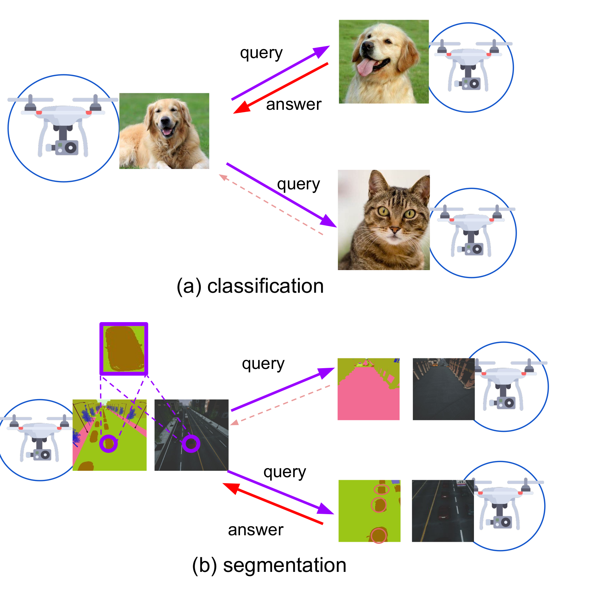
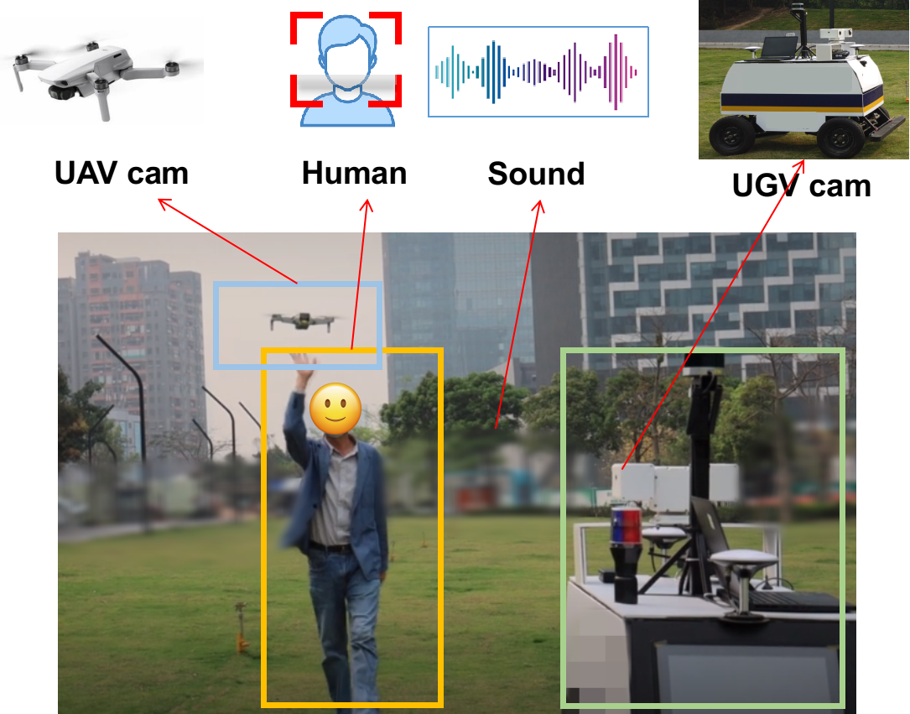

### Few-Shot Multi-Agent Perception
### (FS-MAP)

This is the homepage of 
* Chenyou Fan, Junjie Hu, Jianwei Huang. "Few-Shot Multi-Agent Perception." In 29th ACM International Conference on Multimedia (ACM MM'21).

[comment]: <> (![Demo]&#40;/pics/demo.png 50%&#41;)

[comment]: <> (![Demo_air_ground]&#40;/pics/demo_air_ground.png 50%&#41;)

## Paper
Our paper is here <a href="https://fanchenyou.github.io/homepage/docs/fs_map_1.pdf" target="_blank">FS-MAP</a>.

## Dataset
We use <a href="https://microsoft.github.io/AirSim" target="_blank">AirSim</a> dataset to perform few-shot segmentation task.
We modify this dataset to form few-shot learning tasks. 
We provide direct download link below.

## Experiment on AirSim Dataset
- The code is modified upon <a href="https://github.com/icoz69/DeepEMD" target="_blank">DeepEMD</a>. Please properly cite their excellent work if you use this code in research.
- We provide self-contained implementation in the following section.

### Download dataset and our split
- Download dataset from Google Drive <a href="https://drive.google.com/file/d/1IdXn9Itb67Di44x4smyhRvDGvwtfiAZo/view?usp=sharing" target="_blank">link</a>, extract `airsim-mrmps-data` into `./dataset/` folder.
- Download our trained models from Google Drive <a href="https://drive.google.com/file/d/13LhPlCggBO3mZQRNSj-YYjw65uX0BJjQ/view?usp=sharing" target="_blank">link</a>, extract to `./results` folder, check `results/seg/meta` folders.
- Check our split in `configs/split_save_files.pkl`

### pre-train segmentation
~~~~
python train.py --ph=0 --is_seg=1 --pretrain_dir=results/seg/pre_train
~~~~

### Train 
~~~~
python train.py --ph=1 --is_seg=1 --pretrain_dir=results/seg/pre_train
~~~~

### Evaluation
- check results/seg/meta and find the latest checkpoint dir, to replace XXX
- set "--shot=5" to test 5-shot case
~~~~
python test.py --is_seg=1 --model_dir=XXXX  --loop=0
python test.py --is_seg=1 --model_dir=XXXX  --loop=0 --shot=5
~~~~
to use our trained models, download as above mentioned, and execute
~~~~
python test.py --is_seg=1 --model_dir=results/seg/meta/loop0
python test.py --is_seg=1 --model_dir=results/seg/meta/loop0_st5 --shot=5
~~~~

## Reference
Please cite our work if you use this code.
~~~~
@inproceedings{fan2021fsmap,
  title={Few-Shot Multi-Agent Perception},
  author={Fan, Chenyou and Hu, Junjie and Huang, Jianwei},
  booktitle={ACM MultiMedia},
  year={2021}
}
~~~~

## Other references
Please also properly cite the following excellent work in research.
- <a href="https://github.com/icoz69/DeepEMD" target="_blank">DeepEMD</a>. 
- <a href="https://ycliu93.github.io/projects/multi-agent-perception.html" target="_blank">Multi-Agent Perception</a>. 

## Requirements
Python = 3.8
PyTorch = 1.7+ [[here]](https://pytorch.org/)

GPU training with 4G+ memory, testing with 2G+ memory.

~~~~
pip install scikit-learn pretrainedmodels
~~~~